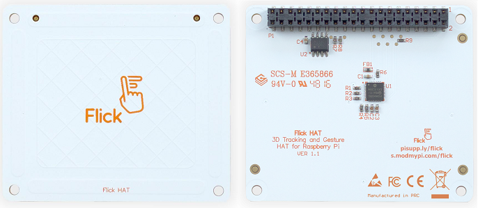
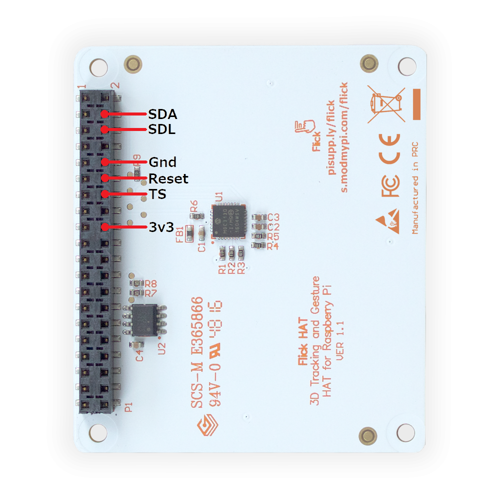
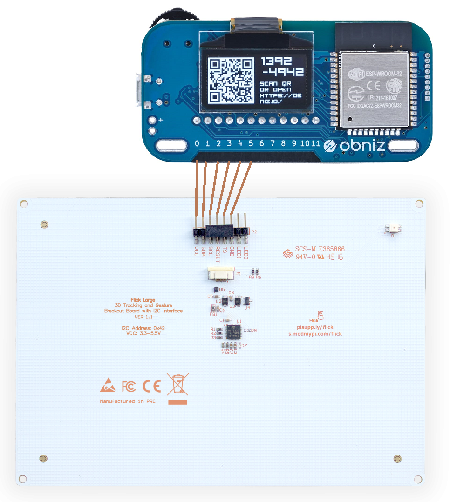

# Flick HAT / Flick Zero / Flick Large


Flick HATはジェスチャトラッキングができるユニークなパーツです。もともとはRaspberry Piに向けたパーツですが、obnizから利用するためのライブラリを作成しました。




## obnizとの接続

Flick HATとFlick Zeroは3.3V駆動のため、電源はobnizのioピンから直接取ることができません。3.3V電源を別に用意してください。電源以外の`SDA,SCL,GND,Reset,TS`は、下図を参考にobnizのioピンに接続します。  




Flick Largeは5V駆動できるため、電源も含めてすべてobnizのioピンに接続します。

Flick Largeには2色のLEDが付いていますが、このライブラリでは制御しません。もし使用する場合は、[LEDライブラリ](https://obniz.io/sdk/parts/LED/README.md)を組み合わせることにより、必要により制御してください。




## wired( { vcc, } sda, scl, reset, ts, gnd )

vcc(5v), gnd, sda, scl, reset, tsをobnizに接続し、接続したioをプログラムで以下のように記述します。
3.3V電源を別に用意した場合は、vccを省略します。

```javascript
// Javascript Example
let flickhat = obniz.wired("FlickHat", { vcc: 0, sda: 1, scl: 2, reset: 3, ts: 4, gnd: 5 });
```


## [await] start({callbackFwInfo})

Flick Hatをリセットして使用できる状態にします。Flick Hatのファームウェア情報を受け取る場合は、引数にコールバック関数を指定します。

```javascript
// Javascript Example
let flickhat = obniz.wired("FlickHat", { vcc: 0, sda: 1, scl: 2, reset: 3, ts: 4, gnd: 5 });
await flickhat.start(function(fwinfo) {
  console.log(fwinfo.fwVersion); //
});
```


## [await] polling({timeout})

Flick Hatをポーリングします。定期的に呼び出す必要があるため、タイマーループまたはobnizのアイドルループ内で呼び出します。引数`timeout`は、何もジェスチャ情報が無い場合にウエイトする最大時間をミリ秒で指定します。省略値は3000ms(3秒)です。

```javascript
// Javascript Example
let flickhat = obniz.wired("FlickHat", { vcc: 0, sda: 1, scl: 2, reset: 3, ts: 4, gnd: 5 });
await flickhat.start();
obniz.repeat(async function() {
  await flick.polling(1000)); //1秒
}, 100);
```

## onxyzプロパティ、ongestureプロパティ、ontouchプロパティ、ontapプロパティ、ondoubletapプロパティ、onairwheelプロパティ

Flick Hatから各種ジェスチャを受け取るためのコールバック関数を指定します。
ハンドリングしたいジェスチャだけコールバック関数を指定すればよい。

- onxyzプロパティ  
  ジェスチャした位置を受け取ります。コールバック関数で受け取るオブジェクトの意味は次の通り。  
  プロパティ | 意味
  |--|--|
  x | x座標：0～1
  y | y座標：0～1
  z | z座標：0～1
  seq | Flick Hat受信データ通番：0～255
  Flick Hatの左下が`x:0, y:0`、右上が`x:1, y:1`、Z軸方向はFlick Hatに近い方が`0`。


- ongestureプロパティ  
  flickジェスチャ（上から下、左から右などのジェスチャ）通知を受け取ります。コールバック関数で受け取るオブジェクトの意味は次の通り。  
  プロパティ | 意味
  |--|--|
  action | 'gesture'（固定）
  from | 'west', 'east', 'north', 'south'のいずれか
  to | 'west', 'east', 'north', 'south'のいずれか
  seq | Flick Hat受信データ通番：0～255

  例：上から下方向のジェスチャの場合 `{ action: 'gesture', from:'north', to: 'south', seq: 99 }`

- ontouchプロパティ  
  touchジェスチャ（タッチイベント）通知を受け取ります。コールバック関数で受け取るオブジェクトの意味は次の通り。  
  プロパティ | 意味
  |--|--|
  action | 'touches'（固定）
  positions | [ 'west'｜'east'｜'north'｜'south'｜'center' ] //タッチされた場所が配列で格納される<br>　'west'：Flick Hatの左側部分、<br>　'east'：右側部分、 <br>　'north'：上側部分、 <br>　'south'：下側部分、 <br>　'center'：中央部分
  seq | Flick Hat受信データ通番：0～255

- ontapプロパティ  
  tapジェスチャ（タップイベント）通知を受け取ります。コールバック関数で受け取るオブジェクトの意味は次の通り。  
  プロパティ | 意味
  |--|--|
  action | 'taps'（固定）
  positions | [ 'west'｜'east'｜'north'｜'south'｜'center' ] //タップされた場所が配列で格納される
  seq | Flick Hat受信データ通番：0～255

- ondoubletapプロパティ  
  double tapジェスチャ（ダブルタップイベント）通知を受け取ります。コールバック関数で受け取るオブジェクトの意味は次の通り。  
  プロパティ | 意味
  |--|--|
  action | 'doubletaps'（固定）
  positions | [ 'west'｜'east'｜'north'｜'south'｜'center' ] //ダブルタップされた場所が配列で格納される
  seq | Flick Hat受信データ通番：0～255

- onairwheelプロパティ  
  air wheelジェスチャ（時計回り、反時計回りのジェスチャ）通知を受け取ります。コールバック関数で受け取るオブジェクトの意味は次の通り。  
  プロパティ | 意味
  |--|--|
  delta | ジェスチャで描いた円の角度（時計回りのジェスチャは正数、反時計回りのジェスチャは負数）
  rotation | ジェスチャで描いた円周の数（時計回りのジェスチャで増加、反時計回りのジェスチャで現象）
  seq | Flick Hat受信データ通番：0～255


```javascript
// Javascript Example
let flickhat = obniz.wired("FlickHat", { vcc: 0, sda: 1, scl: 2, reset: 3, ts: 4, gnd: 5 });
flickhat.onxyz = function(xyz) {
  console.log(xyz); // { x: 0.2, y:0.5, z:0.4, seq: 99 }
}
flickhat.ongesture = function(gesture) {
  console.log(gesture); // { action: 'gesture', from:'north', to: 'south', seq: 99 }
}
flickhat.onontouch = function(ontouch) {
  console.log(touch); // { action: 'touches', positions: ['south', 'center'], seq: 99 }
}
flickhat.ontap = function(tap) {
  console.log(tap); // { action: 'taps', positions: ['east'], seq:99 }
}
flickhat.ondoubletap = function(doubletap) {
  console.log(doubletap); // { action: 'doubletaps', positions: ['center'], seq: 99 }
}
flickhat.onairwheel = function(airwheel) {
  console.log(airwheel); // { delta: 22.5, rotation: 2, seq: 99 }
}
await flickhat.start();
obniz.repeat(async function() {
  await flick.polling();
}, 100);
```
