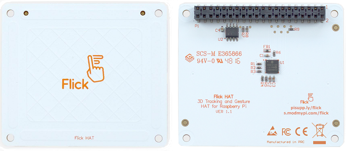
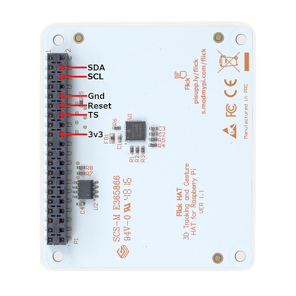
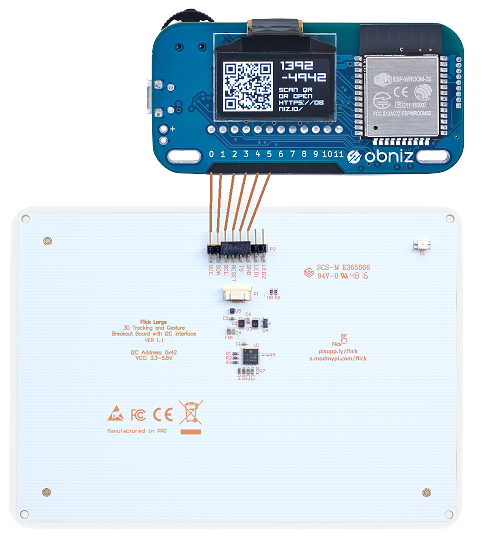
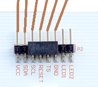

# Flick HAT

[Flick HAT](https://uk.pi-supply.com/products/flick-hat-3d-tracking-gesture-hat-raspberry-pi) / 
[Flick Zero](https://uk.pi-supply.com/products/flick-zero-3d-tracking-gesture-phat-pi-zero) / 
[Flick Large](https://uk.pi-supply.com/products/flick-large-standalone-3d-tracking-gesture-breakout)
はジェスチャートラッキングができるユニークなパーツです。もともとはRaspberry Piに向けたパーツですが、obnizから利用するためのライブラリを作成しました。



日本では
[マルツ](https://www.marutsu.co.jp/pc/i/839457/)や
[RS](https://jp.rs-online.com/web/p/human-machine-interface-hmi-development-kits/1365431/)
から購入可能です。


## obnizとの接続

Flick HATとFlick Zeroは3.3V駆動のため、電源はobnizのioピンから直接取ることができません。3.3V電源を別に用意してください。電源以外の`SDA, SCL, GND, Reset, TS`は、下図を参考にobnizのioピンに接続します。  




Flick Largeは5V駆動できるため、電源も含めてすべてobnizのioピンに接続します。

Flick Largeには`red`と`green`の2色LEDが付いていますが、このライブラリでは制御しません。もし使用する場合は、[LEDライブラリ](https://obniz.io/sdk/parts/LED/README.md)を組み合わせることにより、必要に応じて制御してください。




## wired( { vcc, } sda, scl, reset, ts, gnd )

`vcc(5v), sda, scl, reset, ts, gnd`をobnizに接続し、接続したioをプログラムで以下のように記述します。
3.3V電源を別に用意した場合は、vccを省略します。

```javascript
// Javascript Example
let flickhat = obniz.wired("FlickHat", { vcc: 0, sda: 1, scl: 2, reset: 3, ts: 4, gnd: 5 });
```

Flick LargeでLEDを制御する場合の例；

```javascript
// Javascript Example
let led1 = obniz.wired("LED", { anode: 6 });
let led2 = obniz.wired("LED", { anode: 7 });
```

## [await] start({callbackFwInfo})

Flick Hatをリセットして使用できる状態にします。Flick Hatのファームウェア情報を受け取る場合は、引数にコールバック関数を指定します。

```javascript
// Javascript Example
let flickhat = obniz.wired("FlickHat", { vcc: 0, sda: 1, scl: 2, reset: 3, ts: 4, gnd: 5 });
await flickhat.start(function(fwinfo) {
  console.log(fwinfo.fwVersion); //
});
```


## [await] polling({timeout})

Flick Hatをポーリングします。定期的に呼び出す必要があるため、タイマーループまたはobnizのアイドルループ内で呼び出します。引数`timeout`は、ジェスチャー情報が何も無い場合に監視ループする最大時間をミリ秒で指定します。省略値は3000ms(3秒)です。（`ts`ピンが`high(true)`から`low(false)`に変化することを監視する）

```javascript
// Javascript Example
let flickhat = obniz.wired("FlickHat", { vcc: 0, sda: 1, scl: 2, reset: 3, ts: 4, gnd: 5 });
await flickhat.start();
obniz.repeat(async function() {
  await flick.polling(1000)); //1秒
}, 100);
```

## コールバック関数プロパティ

Flick Hatから各ジェスチャー情報を受け取るためのコールバック関数を指定します。
ハンドリングしたいジェスチャーだけコールバック関数を指定すればよい。

- onxyzプロパティ
- ongestureプロパティ
- ontouchプロパティ
- ontapプロパティ
- ondoubletapプロパティ
- onairwheelプロパティ


## onxyzプロパティ

  ジェスチャーした位置を受け取ります。コールバック関数で受け取るオブジェクトの意味は次の通り。  
  
  プロパティ | 意味
  |--|--|
  x | x座標：0～1
  y | y座標：0～1
  z | z座標：0～1
  seq | Flick Hat受信データ通番：0～255
  
  Flick Hatの左下が`x:0, y:0`、右上が`x:1, y:1`、Z軸方向はFlick Hatに近い方が`0`。


## ongestureプロパティ  
  flickジェスチャー（上から下、左から右などのジェスチャー）通知を受け取ります。コールバック関数で受け取るオブジェクトの意味は次の通り。  
  
  プロパティ | 意味
  |--|--|
  action | 'gesture'（固定）
  from | 'west', 'east', 'north', 'south'のいずれか
  to | 'west', 'east', 'north', 'south'のいずれか
  seq | Flick Hat受信データ通番：0～255

  例：上から下方向のジェスチャーの場合 `{ action: 'gesture', from:'north', to: 'south', seq: 99 }`

## ontouchプロパティ  
  touchジェスチャー（タッチイベント）通知を受け取ります。コールバック関数で受け取るオブジェクトの意味は次の通り。  
  
  プロパティ | 意味
  |--|--|
  action | 'touches'（固定）
  positions | [ 'west'｜'east'｜'north'｜'south'｜'center' ] //タッチされた場所が配列で格納される<br>　'west'：Flick Hatの左側部分、<br>　'east'：右側部分、 <br>　'north'：上側部分、 <br>　'south'：下側部分、 <br>　'center'：中央部分
  seq | Flick Hat受信データ通番：0～255

## ontapプロパティ  
  tapジェスチャー（タップイベント）通知を受け取ります。コールバック関数で受け取るオブジェクトの意味は次の通り。  
  
  プロパティ | 意味
  |--|--|
  action | 'taps'（固定）
  positions | [ 'west'｜'east'｜'north'｜'south'｜'center' ] //タップされた場所が配列で格納される
  seq | Flick Hat受信データ通番：0～255

## ondoubletapプロパティ  
  double tapジェスチャー（ダブルタップイベント）通知を受け取ります。コールバック関数で受け取るオブジェクトの意味は次の通り。  
  
  プロパティ | 意味
  |--|--|
  action | 'doubletaps'（固定）
  positions | [ 'west'｜'east'｜'north'｜'south'｜'center' ] //ダブルタップされた場所が配列で格納される
  seq | Flick Hat受信データ通番：0～255

## onairwheelプロパティ  
  air wheelジェスチャー（時計回り、反時計回りのジェスチャー）通知を受け取ります。コールバック関数で受け取るオブジェクトの意味は次の通り。  
  
  プロパティ | 意味
  |--|--|
  delta | ジェスチャーで描いた円の角度（時計回りのジェスチャーは正数、反時計回りのジェスチャーは負数）
  rotation | ジェスチャーで描いた円周の数（時計回りのジェスチャーで増加、反時計回りのジェスチャーで減少）
  seq | Flick Hat受信データ通番：0～255


```javascript
// Javascript Example
let flickhat = obniz.wired("FlickHat", { vcc: 0, sda: 1, scl: 2, reset: 3, ts: 4, gnd: 5 });
flickhat.onxyz = function(xyz) {
  console.log(xyz); // { x: 0.2, y:0.5, z:0.4, seq: 99 }
}
flickhat.ongesture = function(gesture) {
  console.log(gesture); // { action: 'gesture', from:'north', to: 'south', seq: 99 }
}
flickhat.onontouch = function(ontouch) {
  console.log(touch); // { action: 'touches', positions: ['south', 'center'], seq: 99 }
}
flickhat.ontap = function(tap) {
  console.log(tap); // { action: 'taps', positions: ['east'], seq:99 }
}
flickhat.ondoubletap = function(doubletap) {
  console.log(doubletap); // { action: 'doubletaps', positions: ['center'], seq: 99 }
}
flickhat.onairwheel = function(airwheel) {
  console.log(airwheel); // { delta: 22.5, rotation: 2, seq: 99 }
}
await flickhat.start();
obniz.repeat(async function() {
  await flick.polling();
}, 100);
```
