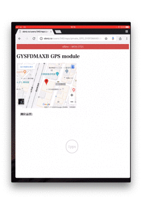
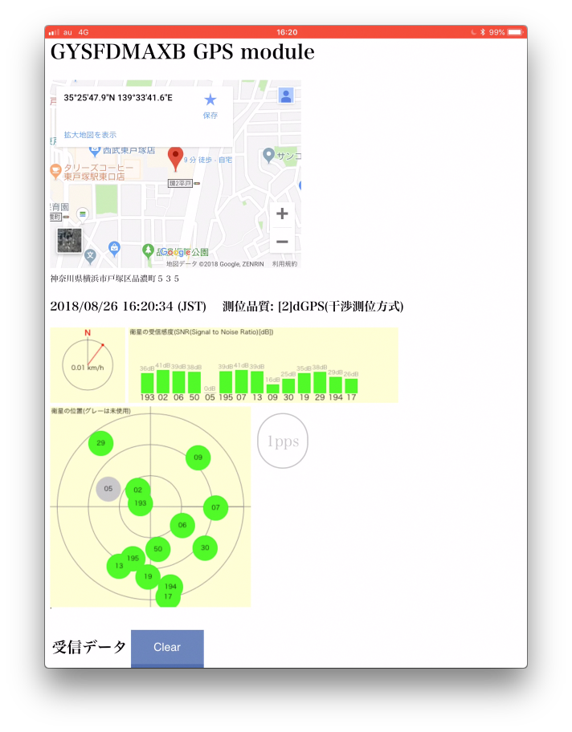
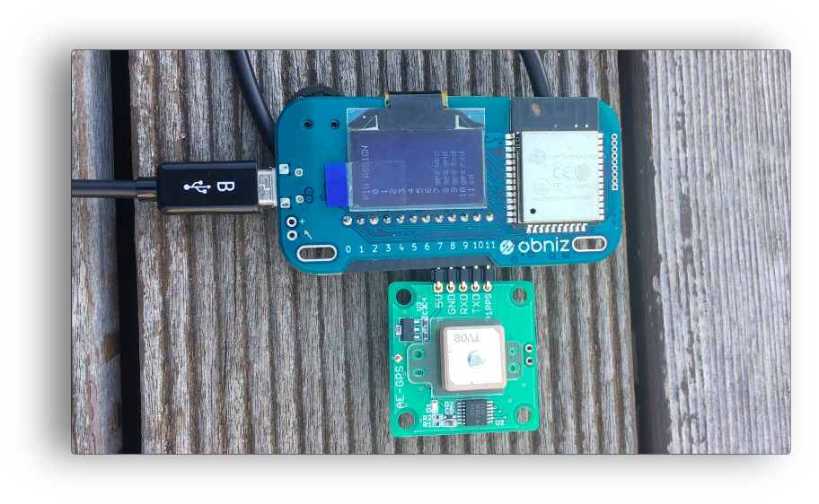

# GPSモジュールをobnizにつなぐライブラリを作りました

## はじめに

 

このGPSモジュール[GYSFDMAXB(太陽誘電)](http://akizukidenshi.com/catalog/g/gK-09991/)をobnizにつないでGPS情報を取得するライブラリを作成しました。  

## サンプルhtml

GPS情報取得ライブラリを使った[サンプル](./GYSFDMAXB.html)です。

- **地図情報** および **住所情報** (地図の下に小さい文字で表示) 
	ライブラリから取得したGPGGAセンテンス(GPS位置情報=経度・緯度情報)からGoogle Mapを表示。	また、Google Mapのgeocodeサービスにて住所情報を取得

- **方向・速度情報** (赤いNが北を示す) 
	ライブラリから取得したGPVTGセンテンス(針路と速度情報)を元に方角と速度を描画

- **衛星情報情報** (棒グラフ および その下の円形の図形) 
	ライブラリから取得したGPGSVセンテンス(衛星情報)を元に衛星の番号と受信感度を描画。
	また、衛星の仰角と方位角から、各衛星の位置を描画
	
- **1PPS** (1PPSの丸い図形) 
	GPSモジュールの1PPSに連動して表示が点滅。(衛星を安定して受信するまでは点滅しません。)

 
	

## GPSモジュールとobnizの接続

GPSモジュールとobnizのピン接続は以下の通り。写真で示す通り、直付けで問題ありません。

|GPS|obniz pin#|
|:-:|:--|
|5V     |7 (5v) |
|GND    |8 (gnd) |
|TXD    |9 (txd)   |
|RXD    |10 (rxd)   |
|1PPS   |11 (opps)   |

 

## GPSモジュールライブラリの説明

Obnizさんのパーツライブラリに取り込んでいただきましたので、[こちら](https://obniz.io/sdk/parts/GYSFDMAXB/README.md)を参照してください。
