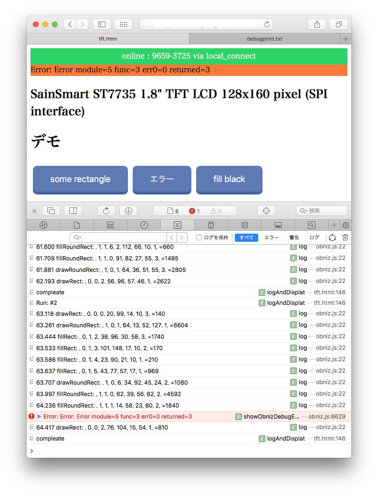

# SainSmart 1.8" TFT LCD サンプルソース 

## はじめに
今回、元ソースから一部を切り出して再現ソースを作成しましたが、なぜかエラーが起きなくなりました。原因不明です。

しかし、矩形をランダムに数十回描画していると、突然エラーが発生することがあります。

```log
[Error] Error: Error: Error module=5 func=3 err0=0 returned=3
	showObnizDebugError (obniz.js:8629)
	error (obniz.js:8598)
	notifyToModule (obniz.js:8564)
	wsOnMessage (obniz.js:7667)
	onmessage (obniz.js:7819)
```

発生確率が低くなってしまいましたが、エラーを起こせるソースコードではありますので、今回これをご提供します。以下、使い方を簡単にご説明します。

## LCDとobnizの接続

LCDとobnizのピン接続は以下の通り。写真で示す通り、直付けで問題ありません。


|LCD|obniz pin#|
|:-:|:--|
|VCC    |6 (5v) |
|GND    |5 (gnd) |
|SCL    |4 (sclk)   |
|SDA    |3 (mosi)   |
|DC     |2 (d/cx)   |
|RES    |1 (reset)  |
|CS     |0 (chip select) |


<br>
## 提供ソースの使い方



LCDとobnizを接続し、当ソース([html](./tft.html))をブラウザで開きます。

obnizとコネクトしLCDの初期化が完了すると、上記スクショの様に３つのボタンが現れます。

- **some rectangle** ：　ランダムな10個の矩形を描画します。<br>
	このボタンを何度か押して矩形を描画していると、エラーが起きる場合がある。

- **エラー** ：　上記でエラーが起きた矩形描画を(手動で)切り出して、それを1回描画する。<br>
	ただし、おそらく、エラーにならず矩形を描画すると思います。
	
- **fill black** ：　LCDを黒一色で塗りつぶします。画面クリア的な機能。

<br>

## 終わりに

ソースコードを見ていただければやっていること（処理内容）は理解いただけると思います。<br>
もし不明点等ありましたら、何なりとご連絡ください。<br>
よろしくお願いします。
