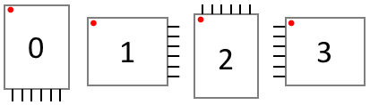

# SainSmartTFT18LCD


Obnizから[サインスマート 1.8インチ TFTカラーディスプレイ](https://www.amazon.co.jp/サインスマート（SainSmart）-カラー-LCD-インタフェース-MicroSD-付き-Arduino/dp/B008HWTVQ2/)に描画するためのライブラリです。なお、このLCDが内蔵するMicroSDへのアクセスはサポートしていません。


このLCDはSPIインターフェースでアクセスしますが、ObnizではArduinoやRaspberry Piの様な高速の描画はできません。また、LCDからデータを読み出すこともできません。  


## wired(scl, sda, dc, res, cs {, vcc, gnd })

scl, sda, dc, res, cs, vcc, gndをobnizに接続し、接続したioをプログラムで以下のように記述します。SD-CARDのアクセスに必要なピンは接続しません。

```javascript
// Javascript Example
lcd = obniz.wired("SainSmartTFT18LCD", { scl:4, sda:3, dc:2, res:1, cs:0, vcc:6, gnd:5});
lcd.begin();
```

## begin()

LCDをハードリセットして描画できるようにします。      


## 描画API

このパーツライブラリはLCDに描画するための様々APIを提供します。はじめに各APIに共通する事項から説明します。  
LCDのサイズは`witdh`と`height`プロパティで得ることができます。

```javascript
// Javascript Example
lcd = obniz.wired("SainSmartTFT18LCD", { scl:4, sda:3, dc:2, res:1, cs:0, vcc:6, gnd:5});
console.log(lcd.width);  //128
console.log(lcd.height); //160 
```

## color16(r, g, b)

後述する`draw()`と`drawBounds()`は18bitカラーモードでLCDに描画します。それ以外の描画APIは引数`color`に16bitRGB値を指定します。`color16(r, g, b)`関数は、引数に指定した各色8bit値(0〜255)から減色して16bitRGB値を作ります。  
　16bitRGB値　⇒　赤(r)：8bit値の上位5bit、緑(g)：8bit値の上位6bit、青(b)：8bit値の上位5bit

```javascript
// Javascript Example
:  :
let red = lcd.color16(255, 0, 0); //16bitRGB for red
lcd.drawRect(0, 0, lcd.width, lcd.height, red);
```

## setRotation(dir)


LCDの向きを`0`から`3`で指定します。初期化後は`0`(正位)です。
この後の描画から有効になり、描画済みの内容の向きは変わりません。



指定した向きに応じて`witdh`と`height`プロパティも再設定されます。また、描画の原点`{top:0, left:0}`は図の赤点の位置、つまり、向きに応じた左上となります。

```javascript
// Javascript Example
:  :
lcd.setRotation(3); //横長向き
console.log(lcd.width);  //160
console.log(lcd.height); //128 
```

## 共通的な引数の説明

描画APIに共通する引数を以下に説明します。

|引数|説明|
|:---|:--|
|x<br>y|描画の起点となる座標を`x, y`で指定します。<br>2点を指定する関数の場合は`x0, y0, x1, y1`、3点を指定する関数の場合は`x0, y0, x1, y1, x2, y2`で指定します。|
|width<br>height|描画する図形の幅と高さを`width`, `height`で指定します。描画APIによっては`width`のみ、`height`のみ指定する関数もあります。|
|color|描画する色を16bitRGB値で指定します。|
|radius|円を描画する場合の半径を指定します。|
|round|角丸矩形を描画する場合の角の丸みの半径を指定します。|
|backgroundColor|`dwarChar()`, `drawString()`において、描画する文字の背景色を指定します。`color`と同じ値を指定した場合は、背景を描画しません。つまり、透過モードとなります。|
|size|`dwarChar()`, `drawString()`において、描画する文字のサイズを指定します。1以上の整数で倍率を表し、`1`：横5ピクセルx縦7ピクセルの文字、`2`：2倍（横10ピクセルx縦14ピクセルの文字）、`3`：3倍、`4`：4倍、・・・。スムージングではなく、縦横単純にピクセルを等倍した文字を描画します。|
|||


## fillScreen(color)

LCD全体を`color`で塗りつぶします。次の`fillRect(0, 0, lcd.width, lcd.height, color)`と等価です。


## drawRect(x, y, width, height, color)<br>fillRect(x, y, width, height, color)

`drawRect()`は引数`x`, `y`, `width`, `height`で指定した矩形を`color`で描画します。
`fillRect()`は塗りつぶします。


## drawRdrawRoundRectect(x, y, width, height, round, color)<br>fillRoundRect(x, y, width, height, round, color)

`drawRoundRect()`は引数`x`, `y`, `width`, `height`, `round`で指定した角丸矩形を`color`で描画します。
`fillRoundRect()`は塗りつぶします。


## drawCircle(x, y, radius, color)<br>fillCircle(x, y, radius, color)
  
`drawCircle()`は引数`x`, `y`を中心座標点として半径`radius`で指定した円を`color`で描画します。
`fillCircle()`は塗りつぶします。


## drawTriangle(x0, y0, x1, y1, x2, y2, color)<br>fillTriangle(x0, y0, x1, y1, x2, y2, color)
  
`drawTriangle()`は引数で指定した座標3点`{x0, y0}`, `{x1, y1}`, `{x2, y2}`を結ぶ三角形を`color`で描画します。
`fillTriangle()`は塗りつぶします。


## drawVLine(x, y, height, color)<br>drawHLine(x, y, width, color)
  
`drawVLine()`は引数`x`, `y`で指定した座標から高さ`height`の垂直線を`color`で描画します。  
`drawHLine()`は引数`x`, `y`で指定した座標から幅`width`の水平線を`color`で描画します。これらの関数は次の`drawLine()`より高速に描画します。


## drawLine(x0, y0, x1, y1, color)
  
`drawLine()`は引数で指定した2点`{x0, y0}`, `{x1, y1}`を`color`で直線を描画します。


```javascript
// Javascript Example
:  :
lcd.setRotation(3); //横長向き
console.log(lcd.width);  //160
console.log(lcd.height); //128 


```


## drawChar(x, y, ch, color, backgroundColor, size)<br>drawString(x, y, str, color, backgroundColor, size, wrap)
  
`drawChar()`は引数`x`, `y`で指定した座標に引数`ch`で指定ASCII文字を`color`で描画します。文字の背景色は`backgroundColor`で指定します。


`drawString()`は文字列を描画します。1文字づつ1文字分の横幅のピクセル数を`x`に加えながら、`drawChar()`を使って描画します。  
引数`wrap`が`true`の場合は、`x>width`の場合に、`y`に1文字分の縦幅のピクセル数を加え、`x=0`にして描画します（つまり、改行します）。また、文字列中に改行コード`'\n'`が出現した場合は`wrap`の値によらず改行します。  
このように`drawString()`内では`x`と`y`を更新しながら文字列を描画して、最後の文字を描画し終わった後の`[x, y]`をリターンします。つまり、戻り値の`x`, `y`を再使用することで、`drawString()`を繰り返し呼ぶことができます。

漢字や他言語などASCII文字以外を描画する場合は、一度、[Canvas](https://developer.mozilla.org/en-US/docs/Web/API/Canvas_API)に描画してから後述する`draw()`や`drawBounds()`を使用してLCDに転送する必要があります。


```javascript
// Javascript Example
:  :
let white = lcd.color16(255, 255, 255); //16bit color for white
lcd.drawChar(0, 0, 'A', white, white);

var x = 10, y = 10;
[x, y] = lcd.drawString(x, y, 'This is 1st draw.', white, white, true);
[x, y] = lcd.drawString(x, y, 'This is 2nd draw.', red, red, true);
```


## drawBound(context, x0, y0, width, height, x1, y1)<br>draw(context)

`drawBounds()`は`canvas.context(2D)`に描画した内容をLCDに転送します。転送元/先の関係を下図に示します。


転送元の`canvas.context`を引数`context`に指定し、範囲を引数`x0`, `y0`, `width`, `height`で指定し、転送先のLCDの座標を引数`x1`, `y1`で指定します。`drawBound()`は`context`の内容を18bitRGBに減色したカラーで描画します。  
`draw()`は`drawBound(context, 0, 0, lcd.width, lcd.height, 0, 0)`と等価です。  
ネットワーク環境にもよりますが`draw()`で約100ミリ秒を要します。よって、動画再生の様な用途には不向きです。


## その他のAPI


LCD表示をON/OFFを制御します。  
`displayOn()`：LCD表示をONします。
`displayOff()`：LCD表示をOFFします。  
`display(on)`：引数`on`が`true`の場合、LCD表示をONします。`false`の場合、LCD表示をOFFします。


## rawBound(x, y, width, height, [pixel0, pixel1, pixel2, ...])<br>raw([pixel0, pixel1, pixel2, ...])

`rawBound()`は引数`x`, `y`, `width`, `height`で指定したLCDの範囲に`pixel0`, `pixel1`, `pixel2`, `...`を順番に描画します。各ピクセルは32bitRGBカラー値で指定しますが、実際の描画は18bitカラー値に減色されます。
`raw()`は`rawBound(0, 0, lcd.width, lcd.height, [pixel0, pixel1, pixel2, ...])`と等価でLCD全体を描画します。  
この関数は`drawPixel()`の繰り返しより遥かに高速で描画できますが、`raw()`で約100ミリ秒を要します。よって、動画再生の様な用途には不向きです。なお、描画性能はネットワーク環境にも依存します。

`raw()`1回当たりのLCDへの転送データ量 ≒ 128 x 160 x 3byte = 60Kbyte　（18bitカラー値の場合）